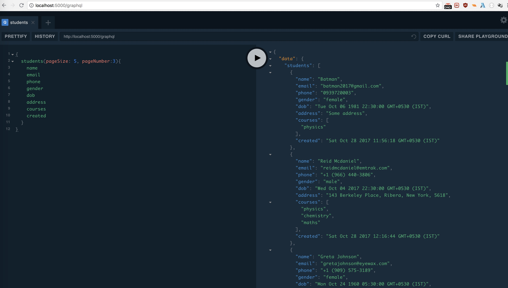

# GraphCool with HAPI and Lambda



### Enable Playground

##### 1.

```
npm i -S graphiql
```

##### 2.

```
    handler: src/v1/graphql/handler.graphql
    events:
      - http:
          path: graphql
          method: post
          cors: true
      - http:
          path: graphql
          method: get
```
